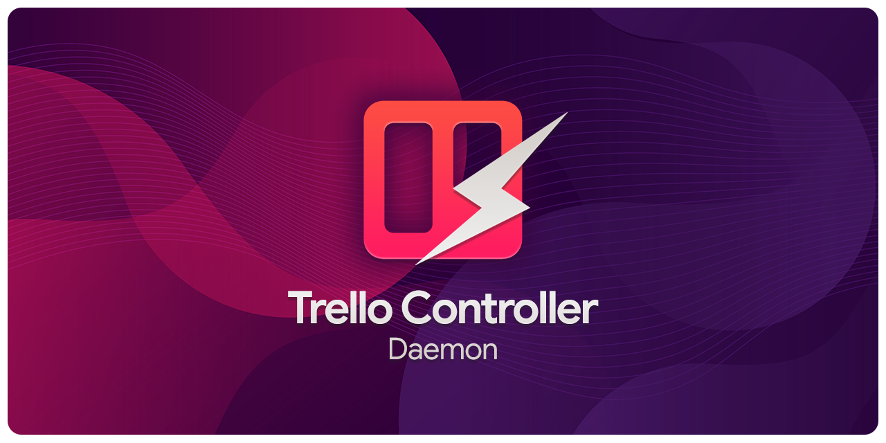

<p align="center">
  
  
  
  
  
</p>

# Trello Controller Daemon

A lightweight, configuration-driven command-line interface (CLI) and background daemon runner for managing and automating multiple Trello boards, featuring built-in session tracking and billing logging.

Built completely in native Node.js without heavy external dependencies.

## Table of Contents

- [Features](#features)
- [Installation & Folder Structure](#installation--folder-structure)
  - [1. Global Folder Setup](#1-global-folder-setup)
  - [2. Local Project Symlink](#2-local-project-symlink)
- [Requirements & Dependencies](#requirements--dependencies)
- [Configuration](#configuration)
  - [Board List Requirements](#board-list-requirements)
- [Usage & Commands](#usage--commands)
- [Session Tracking & Billing Workflow](#session-tracking--billing-workflow)
  - [Step 1: Start a Session](#step-1-start-a-session)
  - [Step 2: Complete the Session](#step-2-complete-the-session)
  - [Working on Multiple Tickets in One Session](#working-on-multiple-tickets-in-one-session)
- [AI Agent & IDE Environment Integration](#ai-agent--ide-environment-integration)
- [Running as a Background Daemon](#running-as-a-background-daemon)

## Features

- **CLI Card Management:** List, search, add, move, comment, label, archive, and delete Trello cards instantly from the terminal.
- **Board Synchronization (`sync`):** Dynamically updates and syncs label configurations (colors, names) defined in `controller.json` with the Trello board.
- **Automated Label Parsing:** Parses custom ticket prefixes (like `[BUG]`, `[FEATURE]`) in card titles, cleans card titles on Trello, and automatically applies corresponding color-coded labels.
- **Session Tracking & Billing Logs (`complete` / `check-done`):**
  - Track session durations.
  - Automatically log completed tickets and checklists into a localized Markdown billing file (`billing-log.md`) with a user-friendly title, consumer details, and time-saving metrics.
- **Project-Agnostic Registry (`projects.json`):** Manage multiple local projects and their Trello credentials from a single, centralized configuration.
- **Background Daemon Polling (`listen` / Runner):** Set up a background cron/task to periodically poll inbox lists and parse cards silently.
- **Automatic Ticket Merging (E-Mail Threading):** Automatically merges email replies/updates (e.g. `Re:`, `Aw:`) sent to the board's email address into existing cards as comments by matching normalized titles, copying description texts, and transferring files/attachments.
- **Email Sender Extraction & Cleanup:** Extracts the original sender's email address (via `.eml` parsing) and prepends it directly to the card description (`**Ticket erstellt von:** [Sender]`) or comment header, while fully stripping out signatures, greeting lines, and previous reply history to keep the board clean.
- **Board Backups:** Exports board structures and cards into a clean local text document (`board_backup.txt`).

## Installation & Folder Structure

To use the Trello Controller across multiple projects efficiently, it is recommended to place this folder globally under a central directory (e.g., `C:\global\.agents\trello`) and link it to each project workspace:

### 1. Global Folder Setup
Place the cloned files inside a central directory of your choice, for example:
`C:\global\.agents\trello\`

### 2. Local Project Symlink
In each of your project directories, create a symbolic link named `.agents` that points to the global agents directory. On Windows (PowerShell):
```powershell
New-Item -ItemType SymbolicLink -Path ".\.agents" -Target "C:\global\.agents"
```

Once linked, any local shell or AI Assistant can access and execute the controller using a uniform, relative path:
`node .agents/trello/controller.js [command]`

This ensures zero configuration overhead per workspace.

## Requirements & Dependencies

- **Node.js:** Node.js (v12.x or higher recommended) must be installed.
- **Zero External Dependencies:** This tool uses 100% native Node.js core APIs (`https`, `fs`, `path`, `child_process`).
  - **No `npm install` required.**
  - **No `node_modules` directory required.**
  - Zero vulnerability risks or network installation overhead.

## Configuration

1. Create a `projects.json` file based on `projects.example.json`:
   ```json
   {
     "TRELLO_KEY": "your_trello_api_key",
     "TRELLO_TOKEN": "your_trello_member_token",
     "TRELLO_BOARDS": {
       "https://trello.com/b/board_id/board_name": {
         "TRELLO_BOARD_EMAIL": "your_board_email@boards.trello.com",
         "TRELLO_LIST_INCOMING": "Incoming Tickets",
         "TRELLO_LIST_ACTIVE": "Active Tickets",
         "TRELLO_LIST_COMPLETED": "Completed Tickets",
         "LOCAL_PROJECTS": [
           {
             "name": "Project A",
             "folder_path": "C:/path/to/your/project-a",
             "billing_path": "C:/path/to/billing-log-a.md"
           },
           {
             "name": "Project B",
             "folder_path": "C:/path/to/your/project-b",
             "billing_path": "C:/path/to/billing-log-b.md"
           }
         ],
         "LAST_CHECKED": ""
       }
     }
   }
   ```

> [!NOTE]
> **Cross-Platform & Laptop Portability:**
> To ensure seamless synchronization between different machines (e.g., Desktop and Laptop via Dropbox) where absolute paths might differ:
> - **Folder Path Fallback:** If the current working directory path does not exactly match `folder_path` in `projects.json` (due to different drive letters or parent folders), the controller automatically falls back to matching the base directory name (e.g. `project-a`).
> - **Billing Path Fallback:** If an absolute `billing_path` is specified but does not exist on the current machine (e.g., pointing to drive `E:` instead of `C:`), the controller automatically falls back to searching for the log file's filename inside the global `.agents/billing/` directory.

2. Create a `controller.json` file containing your board label priorities, prefix mappings, and custom automated message templates:
   ```json
   {
     "priorityOrder": [
       "Important",
       "Bug",
       "Feature",
       "UI/UX",
       "Refactor",
       "Controlling"
     ],
     "labelMappings": [
       {
         "prefix": "[BUG]",
         "color": "red",
         "name": "Bug"
       }
     ],
     "messages": {
       "ticketReopened": "🔄 Ticket automatically reopened: A new email response was received.",
       "emailUpdateReceived": "✉️ Email update received for ticket:",
       "emailContentHeader": "Email Content",
       "noEmailContent": "No email content",
       "processingStarted": "Processing started at {timestamp}",
       "processingCompleted": "Processing completed at {timestamp}. Estimated effort: {estimated_duration}."
     }
   }
   ```

#### How to find your Trello Board Email (`TRELLO_BOARD_EMAIL`):
1. Open your Trello Board in your web browser.
2. Open the Board Menu on the right (click **Show Menu** or `...` under your board header).
3. Click **More**.
4. Select **Email-to-board settings**.
5. Copy your unique board email address shown there. You can also configure which list and card position new emails should go to (recommended: target your Incoming Tickets list).

### Board List Requirements
To ensure the automated workflows function correctly, your Trello board must contain:
- **Inbox List:** Configured via `TRELLO_LIST_INCOMING` in `projects.json` (defaults to `"Incoming Tickets"` if not set).
- **Active Work List:** Configured via `TRELLO_LIST_ACTIVE` in `projects.json` (defaults to `"Active Tickets"` if not set).
- **Completed List:** Configured via `TRELLO_LIST_COMPLETED` in `projects.json` (defaults to `"Completed Tickets"`). If the specified list is not found, the controller falls back to checking list names containing `"implemented"`, `"completed"`, `"complete"`, or `"done"`.

## Usage

Navigate to any registered project directory in your terminal and execute `controller.js`.

### CLI Command Quick Reference

| Command | Usage | Description |
| :--- | :--- | :--- |
| `list` | `node .agents/trello/controller.js list` | Show board lists and cards. |
| `add` | `node .agents/trello/controller.js add "Title" ["Desc"] ["ListName"]` | Create a new card with automatic label assignment. |
| `move` | `node .agents/trello/controller.js move [shortLink] "ListName"` | Move a card to another list. |
| `start` | `node .agents/trello/controller.js start [shortLink]` | Move a card to "Active Tickets", track start time, create local `active_ticket.json`. |
| `complete` | `node .agents/trello/controller.js complete [shortLink] "[estTime]"` | Move card to "Completed Tickets", calculate actual time, log billing session. |
| `check` | `node .agents/trello/controller.js check [shortLink] "ItemName"` | Add a checklist item to a card. |
| `check-done` | `node .agents/trello/controller.js check-done [shortLink] "ItemName"` | Mark a checklist item as completed and update local JSON. |
| `label` | `node .agents/trello/controller.js label [shortLink] [Color] ["LabelName"]` | Add a label to a card. |
| `comment` | `node .agents/trello/controller.js comment [shortLink] "Text"` | Add a comment to a card. |
| `archive` | `node .agents/trello/controller.js archive [shortLink]` | Archive a card. |
| `delete` | `node .agents/trello/controller.js delete [shortLink]` | Permanently delete a card. |
| `search` | `node .agents/trello/controller.js search "Query"` | Search for cards on the board. |
| `inbox` | `node .agents/trello/controller.js inbox` | Run manual incoming ticket & email merging logic. |
| `sync` | `node .agents/trello/controller.js sync` | Synchronize board labels & clean card title prefixes board-wide. |
| `listen` | `node .agents/trello/controller.js listen [intervalMinutes]` | Start the persistent inbox polling daemon in the foreground. |
| `news` / `unread` | `node .agents/trello/controller.js news [peek]` | Show new/unread tickets across all boards. Use `peek` to list without updating LAST_CHECKED. |
| `status` | `node .agents/trello/controller.js status` | Display the status of the background daemon process and scheduled task. |
| `projects` | `node .agents/trello/controller.js projects` | List registered projects, paths, and `.agents` symlink status. |
| `backup` | `node .agents/trello/controller.js backup` | Export the current board layout to `board_backup.txt`. |
| `sort` | `node .agents/trello/controller.js sort` | Sort cards in lists based on priorities. |

### CLI Examples:

```bash
# List all cards grouped by list
node .agents/trello/controller.js list

# Synchronize labels and clean prefixes board-wide
node .agents/trello/controller.js sync

# Add a card to the "Release v1.0" list with automatic labeling
node .agents/trello/controller.js add "Release v1.0" "[BUG] Button is not working on mobile"

# Move a card to a different list
node .agents/trello/controller.js move "shortLink" "Active Tickets"

# Show new/unread incoming tickets across all registered boards
node .agents/trello/controller.js news
```


### Session Tracking & Billing Workflow

This tool includes an automated session calculator and billing logger that operates on a markdown logbook file (defined via `billing_path` inside the project's config block).

> [!TIP]
> **No Manual Effort Required!** You do not need to perform these tracking steps manually. If you are using an AI Coding Assistant/Agent (such as Gemini, Antigravity, Cline, Roo-Code, etc.), the agent can completely automate this Session Tracking and Billing Process for you. Just ask your agent to start working on a ticket, and it will handle all the steps below.

#### Step 1: Start a Session
Before starting your work, add an active session row to the session table in your markdown billing log:
```markdown
| Date | Start | End | Actual | Estimated | Description |
|---|---|---|---|---|---|
| 05/23/2026 | 14:15 | *Active* | | | In Progress (Ticket Name) |
```
Then, tell the controller to start the card (moves it to "Active Tickets" and posts a start comment):
```bash
node /path/to/trello-controller-daemon/controller.js start "shortLink"
```

#### Step 2: Complete the Session
When done, complete the session by specifying the card's shortLink and a manual human time-estimate (e.g. `"1h 30m"` or `"45m"`):
```bash
node /path/to/trello-controller-daemon/controller.js complete "shortLink" "1h 30m"
```
The controller will automatically:
1. Move the card to the **"Completed Tickets"** list (or the list configured in `TRELLO_LIST_COMPLETED`).
2. Locate the active session row (`*Active*` or `In Progress`) in the logbook.
3. Calculate the actual elapsed time and update the session row with the end time, actual duration, and estimate.
4. Generate a consumer-ready billing item block and append it to the logbook.

#### Working on Multiple Tickets in One Session
If your session covers multiple tickets:
1. List all tickets in the active session row description:
   `| 05/23/2026 | 14:15 | *Active* | | | In Progress (Ticket A & Ticket B) |`
2. Start both cards on Trello using their respective shortLinks.
3. When completing:
   - Run `complete` on the **first ticket** first. This closes the active session in the logbook and generates the billing block.
   - Run `complete` on the **remaining tickets**. Since there is no longer an active session in the log, the controller will move them to "Completed Tickets" on Trello without creating duplicate log entries or messing up the logbook.

### AI Agent & IDE Environment Integration

This tool is designed to seamlessly integrate with modern **AI Coding Environments** and IDE Agents (such as Gemini, Antigravity, Cline, Cursor, Roo-Code, or GitHub Copilot). It bridges the gap between task management (Trello) and code execution, allowing the AI agent to operate the system **fully autonomously**.

#### How the Agent Handles the Controller:
1. **Task Ingestion:** When the agent starts, it runs `node .agents/trello/controller.js list` or reads the board configuration to find the next ticket.
2. **Autonomous Activation:** The agent executes the `start [shortLink]` command, which:
   - Moves the card to "Active Tickets" on Trello.
   - Automatically writes a clean, detailed task context file named `active_ticket.json` to the workspace root.
   - Adds an active time-tracking entry into the project's local billing log.
3. **Specification Parsing:** The agent reads `active_ticket.json` to get the full Trello card title, description, checklist items, and labels. The agent now has all the context it needs to write, debug, and test code for that ticket without human intervention.
4. **Interactive Checklists:** As the agent implements features, it checks off checklist items on Trello in real-time using `node .agents/trello/controller.js check-done [shortLink] "[itemName]"` to report progress.
5. **Auto-Completion & Time Tracking:** Once the task is complete, the agent runs the `complete [shortLink] "[estTime]"` command. This:
   - Moves the card to the completed list.
   - Calculates the exact time elapsed during the session.
   - Deletes `active_ticket.json`.
   - Generates and appends a consumer-ready billing line item to the project's markdown billing log.

This allows the agent to handle the entire lifecycle of a ticket fully automated, from start to completion and billing, with zero human overhead. The user simply delegates the ticket to the agent; the agent initiates the session, updates the checklist, calculates the time, and logs the billing item automatically without requiring manual user intervention.

#### Recommended `.gitignore`:
To prevent tracking temporary workspace ticket context in your git commits, add `active_ticket.json` to your project's local `.gitignore` file:
```text
# AI Agent temporary session ticket context
active_ticket.json
```

### Running as a Background Daemon

Start the runner to periodically poll and process incoming cards in the background:

```bash
# Execute a single synchronization and inbox pass
node /path/to/trello-controller-daemon/global_runner.js

# Start persistent listen mode (runs in foreground, polling every X minutes)
# Supports decimal values like 0.1667 (for a 10-second interval)
node /path/to/trello-controller-daemon/controller.js listen 0.1667
```

#### Windows Configuration
To run it completely hidden in the background on Windows (polling every 10 seconds), you can simply run the automated PowerShell installer script in the daemon directory (no admin rights needed):
```powershell
powershell -ExecutionPolicy Bypass -File install_daemon.ps1
```
This automatically registers the task `TrelloInboxProcessor` in your Windows Task Scheduler to run the `run_silent.vbs` script every 1 minute, which executes a 10-second polling loop inside.

#### macOS / Linux Configuration
On macOS or Linux, you can manage the daemon using **PM2** (Process Manager 2) to ensure it stays active, restarts on system boot, and recovers from errors:
```bash
pm2 start "node /path/to/trello-controller-daemon/controller.js listen 0.1667" --name "trello-daemon"
```
Alternatively, schedule it using macOS native `launchd` plist agents or `crontab -e`.

## Automatic Ticket Merging & Reopening (Email & Comment Replies)

To keep your board clean, professional, and organized, the background daemon automatically processes incoming email replies and Trello-native comments:

1. **Email-to-Card Merging:** When a user replies to an existing ticket email and a new card is created (e.g., `Re: [BUG] Video player crash`), the daemon strips email/label prefixes, merges the message as a comment on the original card, transfers any attachments, and deletes the duplicate card.
2. **Trello-Native Comments:** If a user replies to a notification email and Trello posts the message directly as a comment on the existing card, the daemon automatically detects and processes it.
3. **Email Reply & Comment Cleanup:** To prevent comment clutter, the daemon automatically cleanses email descriptions and comments. It removes closing salutations (e.g., `Mit freundlichen Grüßen`, `Viele Grüße`, `Kind regards`), device signatures (e.g., `Gesendet von meinem iPhone`, `Gesendet aus Outlook`), and previous conversation history quoted underneath.
4. **Auto-Reopening:** If the original ticket is archived or currently residing in the **"Completed Tickets"** list, the daemon automatically restores it (unarchives it) and moves it back to the **Inbox** (`Incoming Tickets`), posting a reopening notification comment.
5. **Date Protection Check:** To prevent cards from being falsely reopened when you manually move them back to Completed Tickets or archive them, the daemon compares the comment's creation timestamp against the card's latest move-to-completed or archiving timestamp. The card is only reopened if the comment was posted *after* the move occurred.

## License

MIT License. Feel free to use and customize.
